## Unit 8 - Communication with broader audiences

### Table of contents
* [1. Talking with the media](#1-Talking-with-the-media)
* [2. Panel Interview](#2-Panel-Interview)
* [3. Writing for general audiences](#3-Writing-for-general-audiences)
* [4. Writing a science news story](#4-Writing-a-science-news-story)
* [5. Interviewing a scientist](#5-Interviewing-a-scientist)
* [6. Social media](#6-Social-media)

### 1. Talking with the media
+ **Being Interviewed by a Journalist**
	+ What Interviewer're looking for:
		+ Take-home message
			+ The big picture significant of the work
			+ Things that help put the story in context
		+ How your research affects people (i.e., their readers)
		+ What's different or new about your results (the "news hook")
			+ What distinguishes it from previous studies?
		+ Descriptive engaging language:
			+ Colorful prose, metaphors, descriptions
			+ Some thing controversial or lively or something that has some bite to it
		+ Interesting stories (anecdoties)
			+ I.e, how you came up with the idea of your research?
			+ Anything paradox/irony/surprise
				+ Make the story compelling
			+ People-focused stories
				+ What motivates you?
				+ What keeps you up at night?
			+ Historical fact/ the development of the idea
			+ Sweeping comments about the significance of the work (makes a good first quote)
		+ Controversy/criticism on laudatory praise, if you are being asked to comment on a peer's research
	+  What the interviewee should do:
		+ Speak clearly and concisely and in layperson terms
		+ Be prepared:
			+ Craft some few take-home messages ahead and write these down
			+ Make sure they're clear and easy to understand in the active voice without too much clutters or jargons
		+ Pretend that you are talking to your aunt/uncle/grandparents
		+ Give the journalist clear take-home messages
		+ Anticipate confusions/misinterpretations; and explain them away
		+ Give a clear statement of the key limitations of your work
		+ Thing carefully about how to present data/numbers in a way that is understandable to ta general audience
			+ Make units understandable
+ **Explaining risk to a lay public/journalist**
	+ People are bad at understanding risk.
		+ We tend to be very frightened of things that have a low probability of occuring (i.e., terrorist) whereas we are not adequately frightened about things that occure more commonly (i.e., heart attack)
	+ Whole numbers are easier to understand than fractions and percents (i.e, 10 in 100 rather than 10%)
		+ Presenting risks in a way that's easy to understand
	+ Present absolute risk rather than relative risk
		+ Relative risk can be misleading
		+ **_Example:_**
			+ The risk of cancer increase from 1 in 10,000 to 2 in 10,000
			+ Relative risk: the risk of cancer is doubled => seems high
			+ Absolute risk: of 10,000 people, only 2 have cancer => actually, it's very low
+ **Case study**: Women's Health Initivative
	+ Women;s Health Initiative: large randomized, double-blind study of postmenopausal hormones versus placebo
	+ Halted in 2020 because hormones were found to significantly increase the risks of breast cancer and heart disease
	+ 14 million women were on hormones at the time the study was halted
	+ Results:
		+ **_Relative risks_**:
			+ Relatice risk for invasive breast cancer = 1.26
			+ Relative risk for coronary heart disease = 1.29
			+ Best translation for the public? " Women who take hormones have a 26% increase risk of breast cancer and 29% increased of heart disease"?  
			=> Frightened numbers  
		+ **_Absolute risks_**:
			+ Risk of invasive breast cancer
				+ On hormones: .38% per year
				+ On placebo: .30% per year
				+ Risk incease due to hormones: .08% per year
			+ Risk of heart disease:
				+ On hormones: .37% per year
				+ On placebo: .30% per year
				+ Risk incease due to hormons: .07% per year  
			=> It is actually small  
		+ **_Absolute risks in the whole number_**:
			+ Risk of invasive breast cancer:
				+ On hormmones: 38 per 10,000 women per year
				+ On placebo: 30 per 10,000 women per year
				+ Risk increase due to hormones: 8 additional cases per 10,000 women
			+ Risk of invasive heart disease:
				+ On hormmones: 37 per 10,000 women per year
				+ On placebo: 30 per 10,000 women per year
				+ Risk increase due to hormones: 7 additional cases per 10,000 women
		+ **_Best translation for the public_**:
			+ 26% increase risk of breast cancer and 29% increased risk of heart disease sound scary and shocking
			+ Better to report:
				+ 8 more invasive breast cancers per 10,000 women/year
				+ 7 more heart attacks per 10,000 women/year
				+ Result: all the major media outlets presented those numbers. Most did not even report the relative risks
+ Think carefully about the presentation about the number of risk
	+ As the researcher, you have a lot of control over the numbers that the press focuses on
	+ If you give them the right number, it will certainly appeare on their story
	+ If you don't give journalists the right numbers, they're likely to just report the most dramatic ones from your paper

### 2. Panel Interview
+ **How did the medial learn about your's study?**
	+ Press realizes from in-house press office or journals
	+ **_Tip:_** Build a relationship with your press office!
+ **What did you do to prepare for your interview?**
	+ Do practice interviews with a partner
	+ Identify and document the critical information that you want to communicate
	+ **_Tip:_** It is useful to have a one-page document written out ideas, things you want to be quoted
		+ It helps avoid hesitation, incomplete sentences
	+ Learn about who will be interviewing you, their style, and the type of questions they may ask
	+ Ask for the questions in advance
	+ Ask if there is a predetermined "angle" for the article
+ **Are there times when you might want to turn down an interview?**
	+ Number of requests may be overwhelming
	+ Work with your press office to prioritize requests
+ **What was the most surprising thing about the interview experience?**
	+ An interview is over very quickly
	+ The amount of time you will have to express your thoughts will vary based on the interview format
	+ Much of the interview is prepared ahead of time
	+ Stay focused on your research and be prepared to redirect questions back to your work
+ **What would you do differently to prepare for your next interview?**
	+ Prepare ways to redirect questions to the topics you want to talk about
	+ Practice the key topics you plan to talk about
	+ Make your point and then wait for the next question
	+ help your interviewer stay accurate by pausing or speaking slowly
	+ Prepare a "take-away" statement that reinforces your main point
+ **What tips or advice for young scientists?**
	+ Imagine you are talking to "Uncle Bob" and let yourself use more conversational language
	+ Keeping in mind your audience make it very general
	+ Remember to do mock interviews
+ **Other tips:**
	+ Make sure to review the press release to confirm the accuracy
	+ Get to know your press office contact
	+ Prepare and practice for your interview!
	+ Tailor your message for a wide-audience
	+ Use the opportunity to explain your work
	+ Communicate your work as accurately as possible, but accept that the final result is only partly in your control

### 3. Writing for general audiences
+ **Scientific writing vs Lay public writing**
	+ Whether writing for general audience or other scientists, you should:
		+ Be concise
		+ Be clear
		+ Be engaging
	+ When writing for general audience, you must additionally:
		+ Start with take-home messages
		+ Recognize and avoid jargon
		+ Filter out unnecessary details
		+ Get there faster
		+ Tell a story
+ **Lay summary examples:**
	+ **_Example 1:_**
		+ **_Original:_**
			> _"Here we leverage the wide usage of smartphones with built-in accelerometry to measure physical activity at the global scale. We study a dataset consisting of 68 million days of physical activity for 717,527 people, giving us a window into activity in 111 countries across the globe. We find inequality in how activity is distributed within countries and that this inequality is a better predictor of obesity prevalence in the population than average activity volume."_ (Nature 547, 336-339, 2017)  
		+ **_Lay summary:_**
			> _Researchers used data from smartphones to look at the walking habits of 717,527 people from 111 countries. Countries with the widest gaps between the most active and least active people also had the highest obesity rates. Surprisingly, this "activity inequality" was a stronger predictor of obesity than the total amount of activity._  
	+ **_Example 2:_**
		+ **_Original:_**
			> _Atmospheric water is a resource equivalent to ~10% of all fresh water in lakes on earth. However, an efficient process for capturing and delivering water from air, especially at low humidity levels (down to 20%), has not been developed. We report the design and demonstration of a device based on a porous metal-organic framework {MOF-801,[Zr6O4(OH)4(fumarate)6]} that captures water from the atmosphere at ambient conditions by using low-grade heat from natural sunlight at a flux of less than 1 sun (1 kilowatt per square meter). This device is capable of harvesting 2.8 liters of water per kilogram of MOF daily at relative humidity levels as low as 20% and requires no additional input of energy._ (Science 356: 430-434, 2017)  
		+ **_Lay summary:_**
			> _Scientists have created a device that can pull water out of air. Water-harvesting devices have been built before, but they were impractical for everyday use because they only worked on extremely moist air or required high amounts of energy to run. The new device contains a porous crystal (called a metal-organic framework) that soaks up water vapor like a sponge; a small solar panel provides the energy needed to condense the water into liquid. A prototype containing two pounds of the crystal extracted 12 cups of water from desert air in one day using only sunlight to power._  
+ **Writing for lay audiences**
	1. **_Start with the take-home messages_**  
		+ Tell readers upfront why they should care! Tell them the most important thing first
			+ It isn't difficult, but it's not the way that we're used to writing in science
				+ In science, we usually start with the background and then built-up to the take-home message
				+ When writing for the general audience, we have to flip it
			+ **_Example:_**
				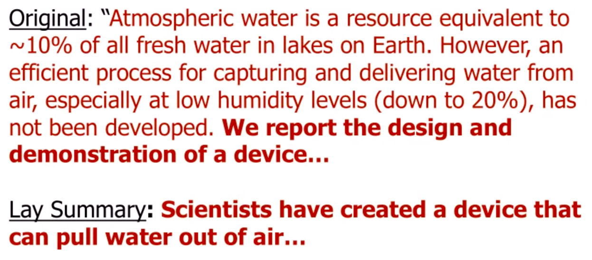  
	2. **_Recognize and avoid jargon_**
		+ This includes not just technical terms, but also "scientist-speak"
			+ A lot of the way we talk in science sound unfamiliar to lay audiences
		+ This is hard for scientists, as we are so immersed into science, we don't event recognize half of the jargon we use
		+ **_Examples:_**
			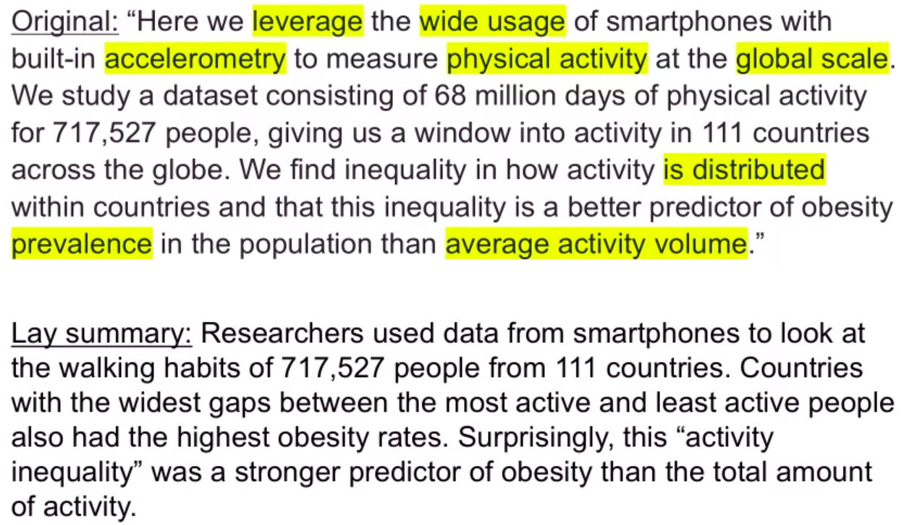  
			  
			  
	3. **_Unpack the science_**
		+ You cannot assume any prior scientific knowledge
			+ Your audience may be unfamiliar with basic scientific concepts that you take for granted.
		+ You need to explain the science——without handwaving!
		+ To be able to explain the science step by step to others, you have to deeply understand the science yourself
		+ **_Examples:_**
			+ The writer had to go to YouTube and watch explanation video about metal-organic framework for writing the lay summary:
				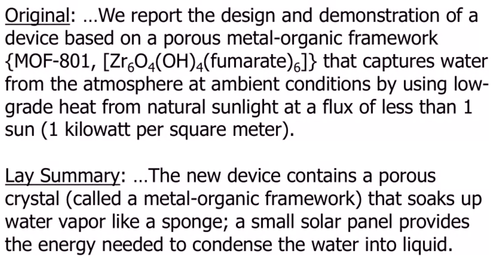
			+ The writer have to come up with a good explanation to for tradeoffs between digital and analog:
				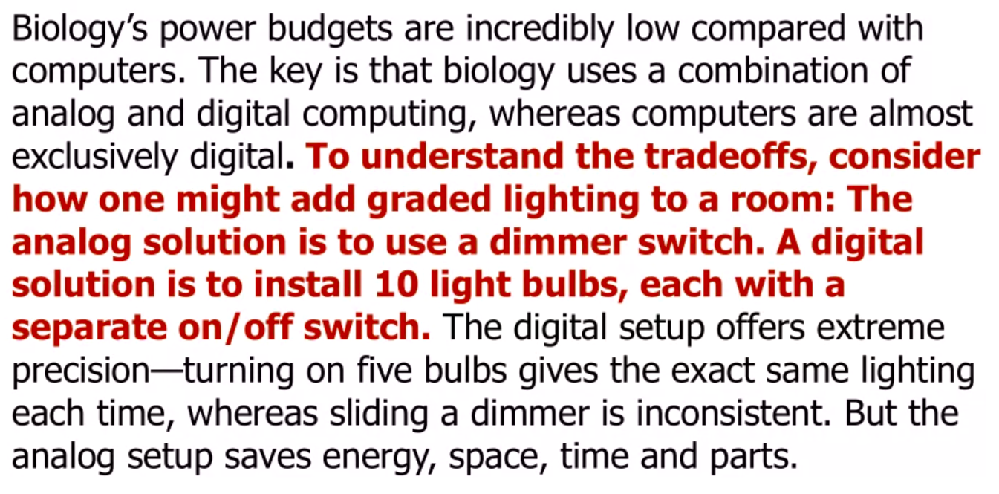  
			+ Sometime, even the writer doesn't even know what the jargon is:
				  
				=> "neural projection", that is a fancy way of saying "axon"
	4. **_Filter out unnecessary details_**  
		+ Prioritize details
		+ Lay audiences don't need to know all the nitty-gritty scientific details
			+ They are just not meaningful or relevant for a lay audience
		+ Imagine an upside down triangle with multiple layers of detail
			+ Layer 1: Big-picture, i.e., drug > placebo
			+ Layer 2: Critical details, i.e., people number, duration, effect,
			+ Layer 3: Meaningful details for lay audience, but might be omitted in a short article, i.e.,  blinded investigation? dosing of the drug?
			+ Layer 4: technical details, i.e., randomization scheme, statistical methods...
			+ Layer 5: trivial details: weighing scale, evaluating method...  
			=> The scientific audience needs all these layer details  
			=> A lay audience needs the two first layers (if it's a short article), or three layers (if it's a long article). The rest are out  
		+ **_Examples:_**
			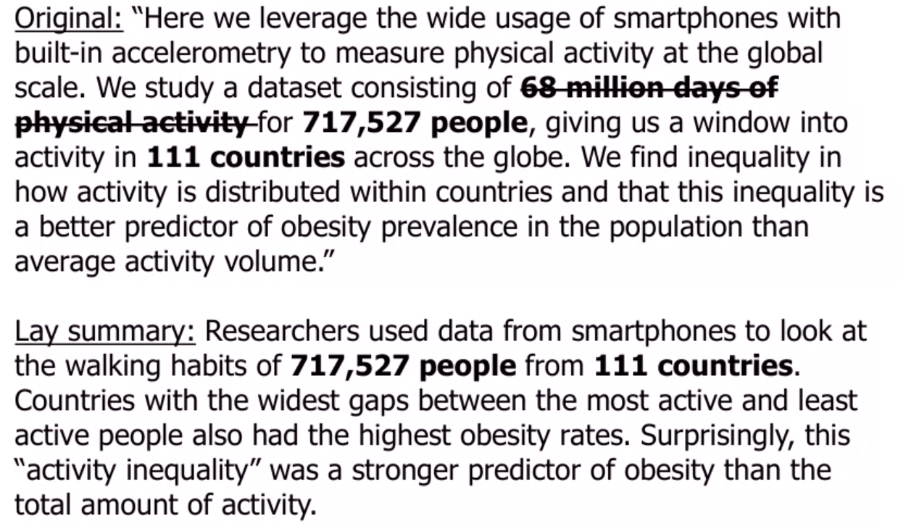  
				=> Prioritize the numbers  
			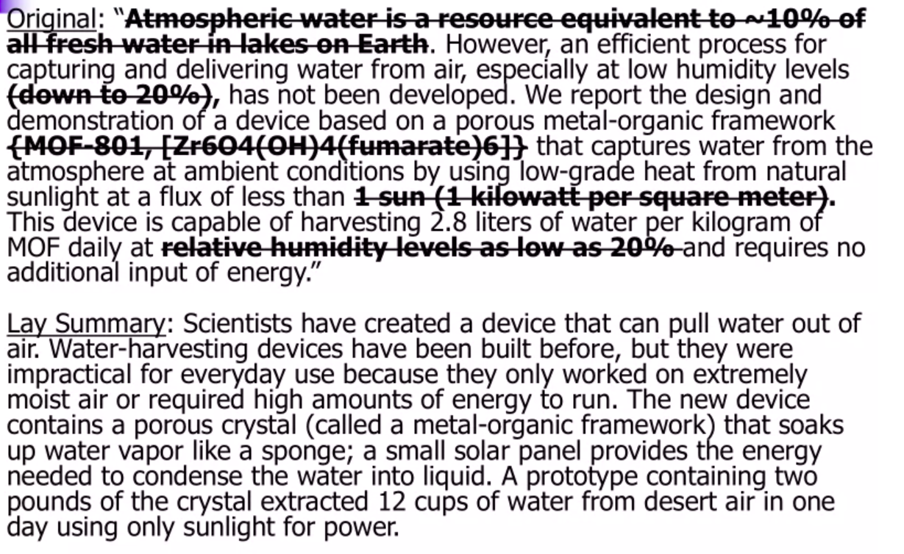  
				=> In the short lay summary, we don't need detail about the amount of water in the air  
				=> The lay reader doesn't think in humidity level. We just say the air is dry or desert, that's more meaningful to them  
				=> Of course, they doesn't need to know the chemical formula, or the unit of sun  
	5. **_Get to the point faster_**
		+ In the journal article science, we tend to take our time getting to the point
			+ Something was done => What was done => What was found => What it all means
		+ In lay audience writing, you should trust your reader
			+ Your reader may not know a lot of science, but you can assume they are intelligent and can make inferences
			+ For example, if you say what a study found, implied in that, maybe what was done and what it means, so you don't have to spell out
		+ Trust your reader
			   
			  
			=> The edited version (one last sentence) contains information about _what was found_. The audience can imply about _what was done_ and _what it all means_.
	6. **_Tell a story_**
		+ Use story-telling techniques to set a scene, (appeal to the 5 scenses——taste, touch, feel, sight, hearing), focus on characters (human beings!), follow a plot (drama and suspense)
		+ **_Example:_**
			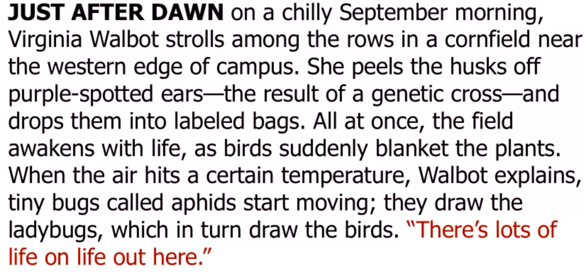
			  
			=> By putting the research into context, that make the science more interesting and more accessible for general audiences  
			=> Be a story teller

### 4. Writing a science news story
+ **News writing**
	+ Most science news stories report about a single recently published paper
	+ The science news story has a very scripted format just like a scientific journal article
	+ Who? What? Where? When? Why? How? (5W's and 1H)
		+ Any good news story provides answers to each of these questions
+ **Basic formula**
	+ Lead
	+ Nut Graft
	+ First quote (3-6 paragraphs down)——brings in the human element
	+ Body of the story
		+ What was done before
		+ What was done in this study——key experiments/key findings
		+ Implications/caveats
	+ Kicker
	+ Typically, news stories are about 500-800 words long, but it can be shorter or longer
+ **Structure**
	+ **_The Lead_**
		+ Encompasses the first paragraph 
			+ The hardest part of the story to write
			+ Coming for the lead takes time, thought and creativity
		+ Grabs the reader's attention
			+ Has to be catchy and relatively short
			+ Imparts the heart of the matter (simple and focused)
		+ Guidelines:
			+ 1-2 sentences (sometimes can be longer)
			+ Aim for <35 words
			+ Use the main verb to carry the main news, and use action verbs to make it engaging
			+ Give complementary, but different information than the headline
			+ Provide some, but not necessarilyy all, of the 5W's and 1H  
		+ **_Example:_**  
			  
			=> The author just giving a flavor for what the story is about and enticing the reader to read on  
	+ **_Nut Graf (Nut Paragraph)_**
		+ Usually contained in one paragraph
			+ Athough it occasionally extends over multiple paragraphs
		+ The Nut Graf gives the nut/heart of the story
			+ Flushes out the 5W's and 1H
		+ Occasionally, the Nut Graf is hidden——contained within the lead or strewn throughout several paragraphs. But usually, it's identifiable  
		+ **_Example:_**  
			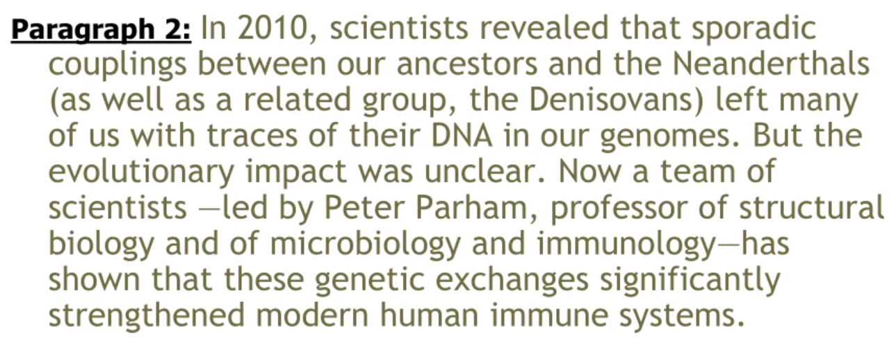  
			=> That basically the what, why and how. The when is 2010, and the who is Prof. Parham.  
	+ **_The First Quotes_**
		+ The fun part of news writing! The interview doesn't involve any 'writing' on your part——just elicting good quotes and strategic placement
		+ Quotes =>
			+ Give a human dimension to the story
			+ Provide evidence
			+ Provide opinion
			+ Provide color and flavor
			+ Flush out the main idea
			+ Move the story along
		+ First quote——often gives _"big picture"_ 
		+ **_Example:_**   
			  
			=> Tell the big picture significant of the paper  
		+ Attribution
			+ The name (noun) goes before the verb (said or says)
				+ _"Blah, blah, blah, blah," Professor Smith said_ (or says).
				+ NOT: _"Blah, blah, blah, blah," said Professor Smith._
				+ UNLESS we have a long description after the name: _"Blah, blah, blah, blah," said Professor Smith, the really boring professor that we all had to take English from_ (long attribution——sounds awkward to say _Prof.Smith, the really boring professor that we all had to take English from, said!_)
			+ Prefer "said" (or "says") to most other possibilities, such as "noted" and "remarked", which have particular connotations...
				+ _"Noted"_ implies that whatever the person's statement was fact
				+ _"Remarked"_ implies that someone is saying something casually
	+ **_Body of the story_**
		+ Long or shot depending on the overall length of the article
		+ Fushes out the story——walk the reader through the important parts of the research
			+ What was done before
			+ Research question
			+ Key experiments
			+ Key findings
			+ Caveats (if room)
			+ Outside commentary (if room)
			+ Implications (if room)
		+ Filter out less important details
		+ Use quotes to add flavor and break upp the story!
		+ **_Example:_**  
			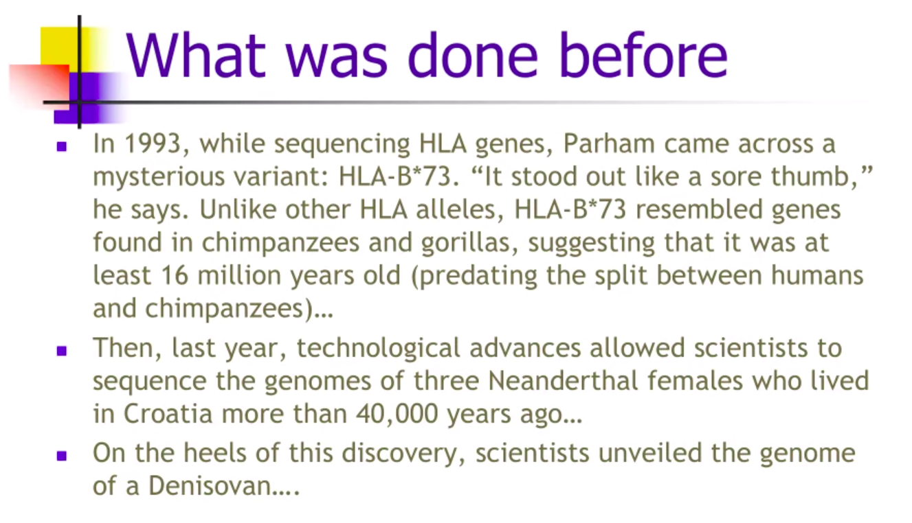  
			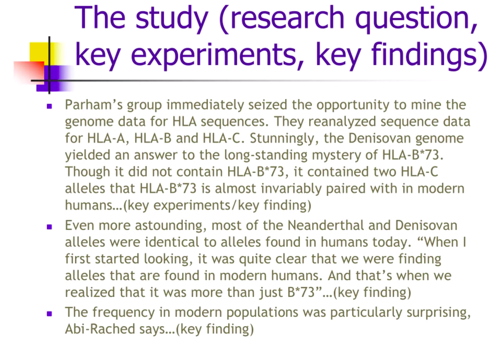  
			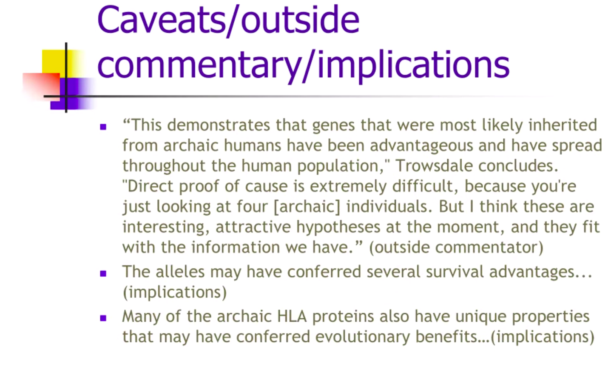
	+ **_The kicker_**
		+ The ending
		+ Leaves the reader feeling satisfied
		+ Often circles back to the Lead
		+ A quote can be effective  
		+ **_Example:_**  
			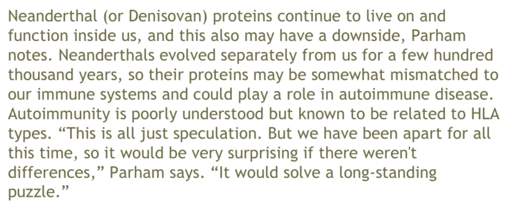
			=> Implication of the fact that we still carry Stone Age Gene (circle back to the Lead)  
			=> End with a nice quote. Put the "Parham says." in the middle of the quote => more engaging  
+ Go out and read some science news stories in the [NY Times](https://www.nytimes.com/), [Nature News](https://www.nature.com/news), [Scientific American](https://www.scientificamerican.com/) and identify these key elments of writing a news story.

### 5. Interviewing a scientist	
+ **Challenge**
	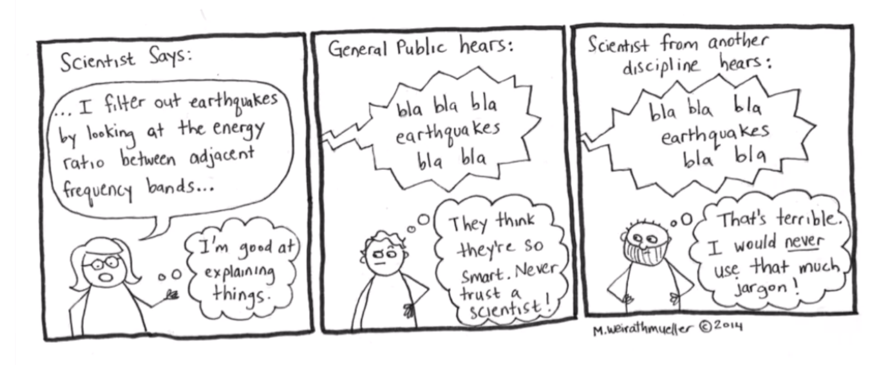  
	+ Understanding the science
	+ Trying to get the scientist to speak in a way that the general public would understand
+ **Why can't scientists leg go of jargon?**
	+ It's how they talk
	+ Don't want to be imprecise
	+ Don't really understand what people do and don't know
		+ Some of these words and concepts are so fundamental to them, in their work, that they don't realize the outsider doesn't know about it at all
	+ Don't care if people understand their work
+ **Why do you need the scientist to speak well?**
	+ You want to quote them
	+ You need their analogies/descriptions
	+ You want the scientists to seem like real people
+ Scientists don't use lay language with other scientists so... you can't appear to be a scientist (check your ego at the door, feel like you can ask stupid questions)
+ **What questions elicited those quotes?**
	+ What is the significance of this work?
	+ Who will benefit from this work?
	+ What did you think when you got the result?
	+ Were they excited, were they confused, were they surprised?
		+ Get some emotion in this work
	+ What made you look into this question?
		+ Get some backstory => help to understand the importance of this research
	+ In the interview, not only you want to ask questions that help you understand the science, but also ask questions that get at the significance in the emotion
+ Anatomy of an interview
	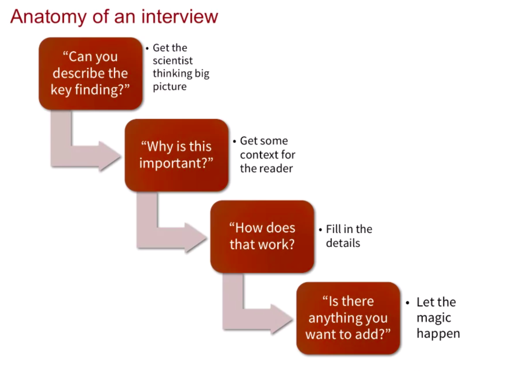  
	+ Can you describe the key finding?
		+The first question always asked is something really big picture
		+ Helps the scientist take a step back and begin thinking kind of big picture
		+ You might read the paper prior
	+ Why it is important?
		+ Help you get some content
			+ Help you think about how you're going to frame the story for readers
	+ How does it work?
		+ Make sure you understand the science well enough to write about it
	+ Is there anything you want to add?
		+ Perhaps the most important question in the interview
			+ This is where the person you interviewing takes a minute to think about interesting, important, or side comments about their research that maybe didn't fit in the paper
			+ Maybe it's perspectives on the research that you wouldn't have thought of, but they had
		+ You often get really interesting answers. Let the magic happen
+ **Using the quote**
	+ Edit the quote:
		+ The rule of thumb: Use a quote exactly as it was said
		+ But be polite, tidy up the quote (erase words, i.e., "um", "really", "you know",...; add punctuation; etc.)
		+ Make the quote make sense, and mean exactly what the person meant it to mean
		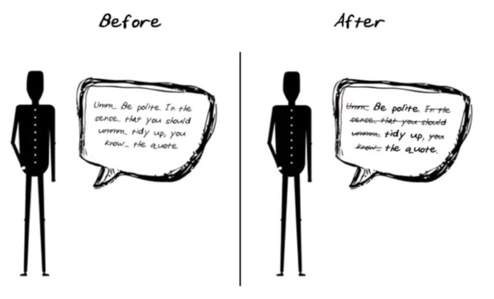  
	+ Tips for editing quotes:
		+ Be truthful
			+ Quotes should be faithful to the words and intended meaning of the speaker. Your goal is not to trap a source into making a mistake. It is to make public a meaningful statement
			+ Don't edit the quote in a way that makes it seem different than it really was
		+ Adding language to quotes is more dangerous than taking stuff out, although both can distort the meaning
			+ Distortion by subtraction is necessary in the very selection of quotes. Distortion by addition can get you fired
		+ Because of language prejudice on race and class, be careful with slang and dialect
		+ The American language is a great treasure
			+ Listen to [NPR](https://www.npr.org/) to get a feel of how skilled reporters and editors reveal the diversity of American speech
		+ Be polite
+ **Q&A: Not exactly one long quote**
	+ A Q&A is a good option when:
		+ You have a scientist who speaks very well
		+ The person is the story
		+ The point of the story is to get that person's opinion
		+ You don't have a lot of time (Q&A eliminates the need to write a lead, nut graf, clever analogies, etc.)
		+ You want to help your readers understand a new process or decision
	+ Edit the Q&A:
		+ The rule of thumb: same as edit the quote
		+ However, you do not need to use the entire answer, as it was said, you can edit it lightly
			+ But it should accurately reflect what that person intended to say
	+ What a Q&A is not:
		+ A literal transcript of the answers (Because people aren't actually  that interesting)
	+ What a Q&A is:
		+ A more succinct, more engaging version of what the person actually said
+ **Interviewing for a Q&A**
	+ Like any other interview except:
		+ You should write the questions out in advance, and have a sense of what your story arc is going to be
			+ Allow you to end up with a Q&A that tells a bit of a story
		+ Have more questions prepared than what you will eventually use
			+ Prepare to dumb some questions if they turn out to be not interested
		+ Be open to detours, but be thinking about they fit into your arc
		+ Be listening to make sure the person answers the full question. You won't be able to write in context or fill in details
		+ A Q&A is not one long quote. Writers must use the interviewee's words and stay true to the intended meaning, but may condense material and move it around to make a more coherent, succinct, and interesting story.   
			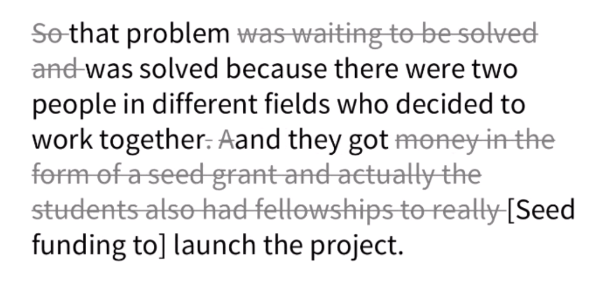  

### 6. Social media
+ **Social media by the numbers**
	+ Twitter: Huge
	+ FB/Insta: Moderate
	+ Blog/Medium: Small
+ **Why engage?**
	+ Reputation of a school or institute
	+ Promote your cause
	+ Show thought leadership
	+ Engage people in a topic
	+ Drive traffic to a website or blog
	+ Promote a personal brand
	+ Connect with like-minded people  
	=> Know what you want to achieve before starting to engage (as it takes time). THEN figure out how you are going to measure success
+ **Twitter**
	+ People often use Twitter for news, information, news outlet (rather than Facebook)
	+ Twitter has
		+ Hashtag (i.e. #deeplearning): easy to follow news and people related on the same topic
		+ Handout (i.e., @computervision): follow people without letting them know
		+ Image, video, URL link
		+ Tweets and retweets (limited to 150 words)
		+ People to follow (journalist, scientist, science organization,...)
	+ Keep your friends close and your enemies closer in a Tweetdeck column
	+ When you start thinking about tweeting
		+ Think about how you can be you, a real person tweeting
	+ Posting a scientific tweet is just like writing a lay summary recap (with 1-2 sentences)
		+ Or just write a catching title (with an URL link)
	+ A case story:
		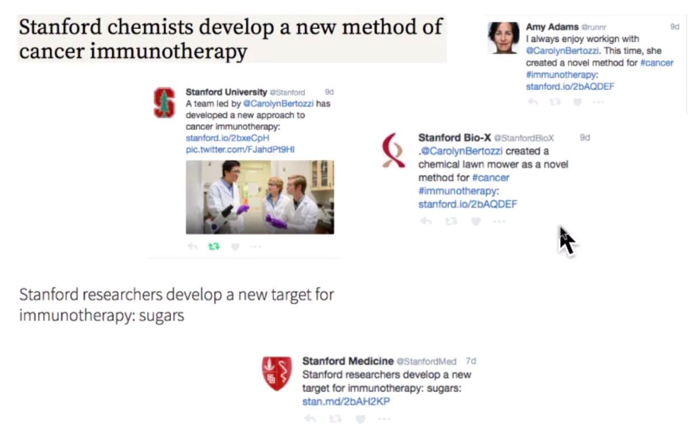  
	+ Twitter is incredibly powerful, you can reach an incredible number of people without knowing them
		+ You can spend an extraordinary amount of time following people, and seeing what people are saying
		+ It is powerful and time-consuming
+ **Facebook**
	+ Organizations use it to retain and engage existing friends
	+ It's a less effective way of reaching a general audience
	+ Very image/video-driven
		+ If you don't have good images or videos, your FB post will not go far
	+ Hard to use as a way of spreading science content
	+ Can educate existing friends on a personal page
+ **Blogs**
	+ Who blogs about science
		+ Individual scientists blogging about their work or their field
		+ Scientific organization blog about the science they fund
		+ New outlets run blogs to fill in background on longer stories, or to cover other topics (Nature Jobs)
		+ Groups of scientists might start a blog on a field of research (NeuWrite West)
	+ If you have a blog, you need a Twitter account to drive the traffic in
	+ Blogs also take a lot of time and they are very hard to get a following for
		+ On the one hand, it a great way to convey a large chunk of information to people
		+ On the other hand, you need to think hard about how you're going to drive people to that blog
+ **Social media roundup**
	+ Think about what you are trying to achieve before drive-in
	+ If drive-in, be real (because if you are trying too hard it shows)
		+ Show the public what scientists are thinking and doing, what their lives are like
	+ To pull that off, know who you are talking to
	+ And know why those people would follow you
	+ And finally: **_Engage, don't teach_**

***

  
  
_This note was created by [**quanghuy0497**](https://github.com/quanghuy0497/Writing-in-the-Science_Stanford)@2021_

